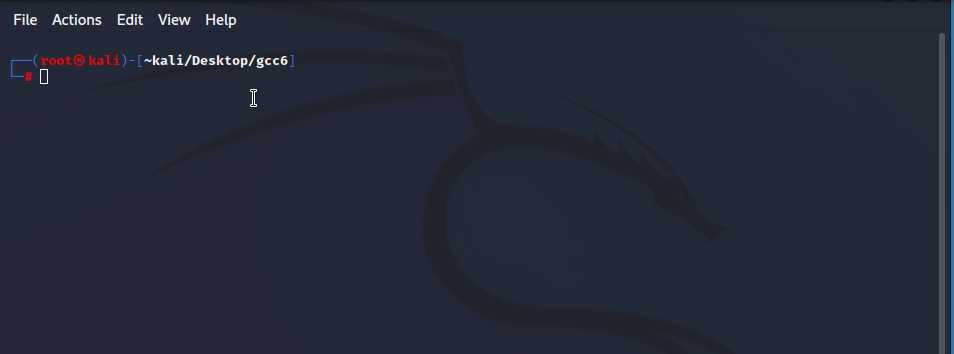

# Kali Docker gcc6 compiler

# Installation
- do ./install.sh

# How to use?
- put file to compile into current directory
- do ./buildcontainer.sh
- do ./compileascript.sh
- use the compiled binary in current directory

# Why?
Compiling old exploits (= old Software)

# Who did what?
- The .sh files and compose made/adapted by SAAD-IT
- Dockerfile from original repo: https://github.com/kunitoki/cxx-docker-images/blob/master/images/clang-6/Dockerfile
- License for the dockerfile by kunitoki https://github.com/kunitoki/cxx-docker-images/blob/master/LICENSE
- Tool for gif recording is Peek https://github.com/phw/peek

# Disclaimer
Lawful activity only. SAAD-IT is not responsible for abuse.
